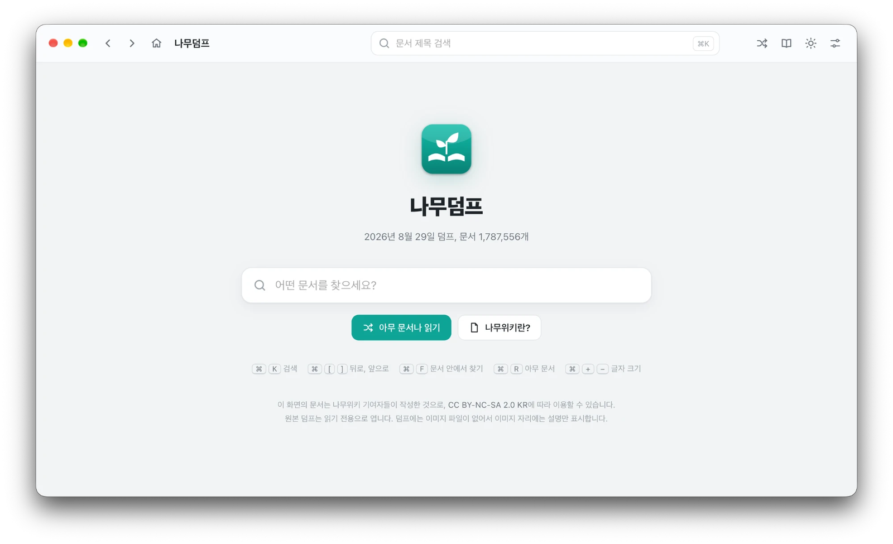

# 나무덤프

나무위키 덤프 파일을 맥에서 인터넷 없이 읽는 프로그램입니다. 표 색상, 글자 크기, 틀, 수식, 각주, 접기 같은 문서 서식을 되도록 나무위키에서 보던 모습 그대로 보여 줍니다.

> 나무덤프는 나무위키 운영사와 관계없는 비공식 프로그램입니다. 덤프 파일은 들어 있지 않으므로 직접 구해야 합니다.

<p align="center"></p>

## 할 수 있는 것

- **제목 검색**: 입력하는 대로 제목을 제안합니다. 결과 화면에서는 검색어로 시작하는 제목과 검색어가 들어간 제목을 모두 보여 줍니다.
- **위키처럼 읽기**: 문서 안 링크, 뒤로와 앞으로, 목차(본문 안과 오른쪽), 문단 접기, 각주 말풍선, 접기 상자, 틀의 탭 전환
- **서식 살리기**: 표 색상, 글자 색과 크기, 수식(KaTeX), 들여쓰기, 인용, 목록
- **화면 설정**: 시스템, 라이트, 다크 모드(다크에서는 나무위키의 다크 모드 색 사용), 글자 크기, 본문 너비
- **보관함**: 최근 본 문서와 즐겨찾기. 방문 기록은 설정에서 끌 수 있습니다.
- **없는 문서 표시**: 덤프에 없는 문서로 가는 링크는 빨갛게 표시하고, 누르면 비슷한 제목을 제안합니다.
- **맥에 맞춘 조작**: 트랙패드로 쓸어서 뒤로, 앞으로 가기, 끝에서 튕기기, 마우스 옆 단추

## 준비물

- **macOS 11 이상**
- **Python 3.8 이상**: 맥에 없다면 터미널에서 `xcode-select --install`을 실행하거나 [python.org](https://www.python.org/downloads/macos/)에서 설치하세요.
- **나무위키 덤프 파일**(`namu-html.sqlite` 형식): 이 저장소는 덤프를 배포하지 않고, 구하는 곳도 안내하지 않습니다. 필요한 형식은 [개발 안내의 "덤프 형식"](DEVELOPMENT.md#덤프-형식)에 적어 두었습니다.

## 설치

1. [최신 릴리스](../../releases/latest)에서 `namudump-버전.dmg`를 내려받아 엽니다.
2. 창에 보이는 **나무덤프**를 옆의 **응용 프로그램** 폴더로 끌어다 놓습니다.
3. 응용 프로그램 폴더에서 나무덤프를 엽니다.

**"확인되지 않은 개발자"라며 열리지 않을 때**: 애플의 인증을 받지 않은 앱이라서 그렇습니다. **시스템 설정 → 개인정보 보호 및 보안**으로 가서 아래쪽의 **그래도 열기**를 누르세요.

**"손상되었기 때문에 열 수 없습니다"라고 나올 때**: 터미널에서 다음을 한 번 실행한 뒤 다시 여세요.

```bash
xattr -dr com.apple.quarantine /Applications/나무덤프.app
```

## 처음 실행

1. 처음 열 때는 독립 창에 필요한 구성 요소([pywebview](https://pywebview.flowrl.com))를 인터넷에서 내려받아 설치하느라 1분쯤 걸립니다. 설치에 실패하면 크롬 계열 브라우저의 앱 창이나 기본 브라우저로 열립니다.
2. 첫 화면에서 덤프 파일을 고릅니다. `다운로드` 폴더에 `namu-html.sqlite`로 두면 자동으로 찾습니다. 외장 드라이브 등 다른 곳에 두었다면 한 번 고른 뒤로는 그 파일을 기억합니다.

## 쓰는 법

| 단축키 | 동작 |
|---|---|
| ⌘K 또는 / | 검색 |
| ⌘[ , ⌘] | 뒤로, 앞으로 |
| ⌘⇧H | 처음 화면 |
| ⌘F | 문서 안에서 찾기 |
| ⌘R | 아무 문서 |
| ⌘D | 즐겨찾기에 넣기, 빼기 |
| ⌘Y | 보관함(최근 본 문서, 즐겨찾기) |
| ⌘, | 설정 |
| ⌘+ , ⌘− , ⌘0 | 글자 크게, 작게, 원래대로 |
| esc | 열린 창이나 말풍선 닫기 |

- 트랙패드 두 손가락 쓸기, 매직 마우스 한 손가락 쓸기, 마우스 옆 단추로도 뒤로, 앞으로 갈 수 있습니다. 돌아오면 읽던 자리가 그대로입니다.
- 문서에서 글자를 골라 오른쪽 클릭하면 그 말로 제목을 검색할 수 있습니다.
- 외부 링크는 기본 웹 브라우저로 열립니다. 유튜브 같은 동영상은 누르면 문서 안에서 재생합니다(인터넷 필요).

## 한계

- **이미지가 없습니다**: 덤프에 이미지 파일이 없고 원래 주소도 만료되어서, 이미지 자리에는 원래 크기의 틀과 설명만 보여 줍니다.
- **제목만 검색합니다**: 본문 내용 검색은 지원하지 않습니다.
- **본문만 있습니다**: 역링크, 문서 역사, 토론은 덤프에 없어서 볼 수 없습니다.
- **덤프 시점의 내용입니다**: 덤프 이후에 바뀐 내용은 반영되지 않습니다. 문서마다 "나무위키에서 보기" 단추로 최신판을 열 수 있습니다.

## 데이터와 개인정보

- 덤프 파일은 읽기만 하고 절대 고치지 않습니다.
- 설정, 즐겨찾기, 방문 기록, 실행 기록은 이 컴퓨터의 `~/Library/Application Support/NamuDump`에만 저장합니다. 어디로도 보내지 않습니다.
- 인터넷은 처음 실행할 때 구성 요소를 설치하거나, 동영상을 재생하거나, 외부 링크를 열 때만 씁니다.

## 업데이트와 삭제

- **업데이트**: 새 버전의 .dmg로 설치 과정을 한 번 더 하면 됩니다. 설정과 기록은 그대로 남습니다.
- **삭제**: 응용 프로그램 폴더의 나무덤프를 휴지통에 넣습니다. 설정과 기록까지 지우려면 `~/Library/Application Support/NamuDump` 폴더도 지웁니다.

## 라이선스

- 나무덤프의 코드는 [MIT 라이선스](LICENSE)를 따릅니다. 자유롭게 쓰고, 고치고, 나눌 수 있습니다.
- 앱이 보여 주는 문서 내용은 나무위키 기여자들이 작성했으며 [CC BY-NC-SA 2.0 KR](https://creativecommons.org/licenses/by-nc-sa/2.0/kr/)에 따라 비영리 목적으로만 이용할 수 있습니다. 코드의 라이선스는 문서 내용에 적용되지 않습니다.
- 수식 표시에 [KaTeX](https://katex.org)의 CSS와 글꼴(MIT, [web/katex/LICENSE](web/katex/LICENSE))을 씁니다. 독립 창에는 처음 실행할 때 설치하는 [pywebview](https://github.com/r0x0r/pywebview)(BSD)를 씁니다.

## 개발

코드 구조, 실행과 시험, 빌드와 배포 방법은 [DEVELOPMENT.md](DEVELOPMENT.md)에 있습니다. 바뀐 점은 [CHANGELOG.md](CHANGELOG.md)에 적습니다.
